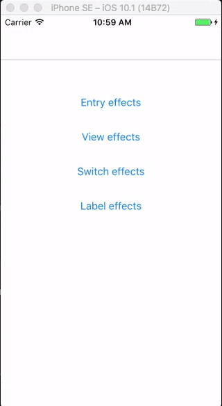

=======

Organon is a library of Effects for Xamarin.Forms.

Included effects:

| Effect                     | Description | iOS | Android | UWP |
|----------------------------|-------------|-----|---------|-----|
| CapitalizeKeyboardEffect | Enforces caps on the keyboard for an Entry | x | x | x |
| ClearEntryEffect | Adds a clear button to an Entry | x | x | - |
| RemoveBorderEffect | Removes the border from an Entry on iOS | x | - | x |
| RemoveEntryLineEffect | Removes the underline from an Entry on Android | - | x | - |
| ViewBlurEffect | Blur any view | Todo | Todo | x |
| ChangeColorSwitchEffect | Change colors of switch | Todo | x | Todo |


###### iOS

To use this on iOS you need to call

```
Organon.XForms.Effects.iOS.iOSEffects.Init();
```

from your AppDelegate. This ensures the assembly is loaded and the effects are available.

###### Samples iOS

  

###### Samples Android
